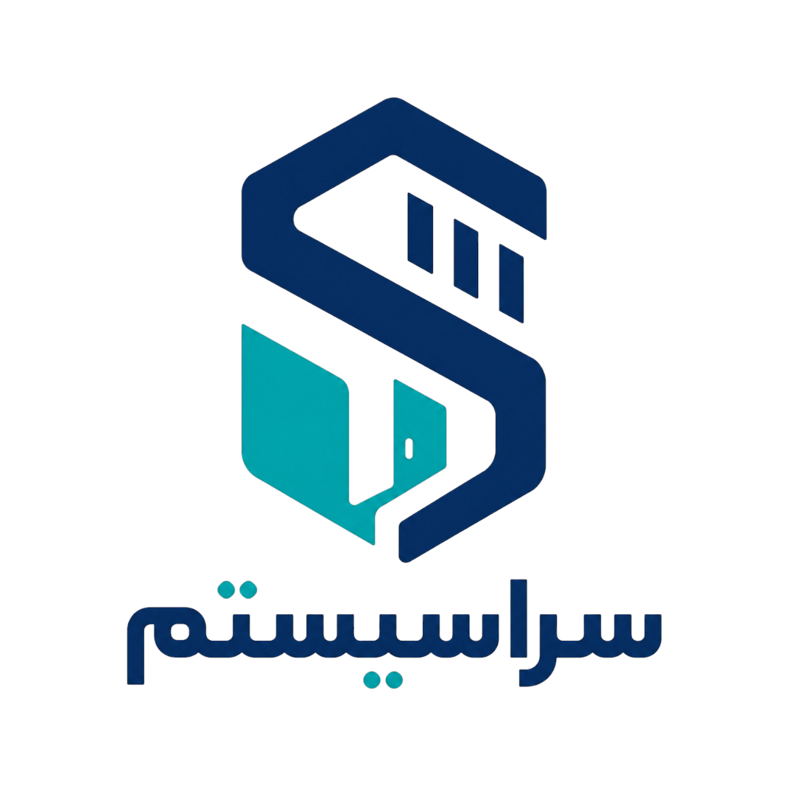

<div dir="rtl" align="center">



# سراسیستم | SaraSystem

### سامانه جامع مدیریت خوابگاه دانشجویی

یک وب‌اپلیکیشن یکپارچه برای مکانیزه‌سازی فرایندهای اصلی خوابگاه؛ از ثبت درخواست اسکان و تخصیص اتاق و تخت تا مدیریت پرداخت‌ها، تعمیرات، اعلان‌ها و کنترل دسترسی کاربران.

</div>

---

## فهرست مطالب

- [معرفی پروژه](#معرفی-پروژه)
- [مسئله‌ای که حل می‌کند](#مسئلهای-که-حل-میکند)
- [قابلیت‌های اصلی](#قابلیتهای-اصلی)
- [نقش‌های کاربری](#نقشهای-کاربری)
- [معماری سیستم](#معماری-سیستم)
- [تکنولوژی‌ها](#تکنولوژیها)
- [ماژول‌های اصلی بک‌اند](#ماژولهای-اصلی-بکاند)
- [مدل داده](#مدل-داده)
- [نقشه راه](#نقشه-راه)
- [مستندات پروژه](#مستندات-پروژه)

---

## معرفی پروژه

**سراسیستم** یک سامانه تحت وب برای مدیریت خوابگاه‌های دانشجویی است. هدف پروژه، تبدیل فرایندهای پراکنده و دستی خوابگاه به یک جریان دیجیتال، شفاف و قابل پیگیری است.

در این سامانه، دانشجو می‌تواند درخواست اسکان ثبت کند، وضعیت درخواست خود را ببیند، اطلاعات اتاق و تخت تخصیص‌یافته را مشاهده کند، پرداخت‌های مرتبط با اسکان را پیگیری کند، درخواست تعمیرات ثبت کند و اعلان‌های عمومی یا هدفمند را دریافت کند.

از سمت مدیریتی، مسئول خوابگاه و مدیر سیستم می‌توانند درخواست‌ها را بررسی کنند، ظرفیت اتاق‌ها و تخت‌ها را مدیریت کنند، تخصیص‌ها را انجام دهند، پرداخت‌ها را رصد کنند، اعلان منتشر کنند و گزارش‌هایی از وضعیت کلی خوابگاه داشته باشند.

---

## مسئله‌ای که حل می‌کند

در بسیاری از خوابگاه‌ها، فرایندهایی مثل ثبت درخواست اسکان، تخصیص اتاق، مدیریت ظرفیت، پیگیری تعمیرات، پرداخت هزینه‌ها و اطلاع‌رسانی با روش‌های دستی یا ابزارهای جداگانه انجام می‌شود. این روش‌ها معمولاً باعث موارد زیر می‌شوند:

- تأخیر در پاسخ‌گویی
- افزایش خطای انسانی
- نبود شفافیت در وضعیت درخواست‌ها
- دشواری در پیگیری سوابق
- دوباره‌کاری در ثبت و بررسی اطلاعات
- نبود گزارش‌های دقیق مدیریتی

سراسیستم با ایجاد یک بستر متمرکز، این فرایندها را ساختاریافته، قابل کنترل و قابل توسعه می‌کند.

---

## قابلیت‌های اصلی

### مدیریت کاربران و احراز هویت

- ثبت‌نام و ورود کاربران
- مدیریت نشست کاربران
- احراز هویت امن با JWT
- فعال یا غیرفعال‌سازی حساب‌ها
- نگهداری اطلاعات پایه کاربران
- آمادگی برای افزودن احراز هویت چهره در آینده

### مدیریت نقش‌ها و دسترسی‌ها

- تعریف نقش‌های مختلف
- تخصیص نقش به کاربران
- تعریف مجوز برای هر نقش
- کنترل دسترسی مبتنی بر نقش یا RBAC
- جداسازی سطح دسترسی دانشجو، مسئول خوابگاه، مدیر و پشتیبانی

### مدیریت اسکان

- ثبت درخواست اسکان توسط دانشجو
- بررسی درخواست توسط مسئول خوابگاه
- تأیید یا رد درخواست‌ها
- تخصیص خوابگاه، اتاق و تخت
- نگهداری تاریخچه تخصیص اسکان
- مشاهده وضعیت درخواست توسط دانشجو

### مدیریت خوابگاه، اتاق و تخت

- ثبت و مدیریت خوابگاه‌ها
- ثبت و مدیریت اتاق‌ها
- ثبت و مدیریت تخت‌ها
- مشاهده ظرفیت کل و ظرفیت خالی
- مدیریت وضعیت اشغال اتاق‌ها و تخت‌ها

### مدیریت پرداخت‌ها

- ثبت پرداخت‌های مرتبط با اسکان
- پیگیری وضعیت پرداخت
- ثبت بدهی‌ها و مهلت پرداخت
- نگهداری سوابق مالی کاربران
- آمادگی برای اتصال به درگاه پرداخت

### مدیریت تعمیرات

- ثبت درخواست تعمیرات توسط کاربران
- اولویت‌بندی درخواست‌ها
- ارجاع درخواست‌ها به واحد پشتیبانی
- به‌روزرسانی وضعیت رسیدگی
- ثبت زمان حل مشکل و نگهداری سوابق

### مدیریت اعلان‌ها

- ایجاد و انتشار اعلان
- هدف‌گذاری اعلان بر اساس نقش یا خوابگاه
- مشاهده اعلان‌ها توسط کاربران
- ثبت وضعیت خوانده‌شدن اعلان‌ها
- امکان غیرفعال‌سازی یا زمان‌بندی انقضای اعلان

### گزارش‌گیری

- گزارش وضعیت اشغال خوابگاه‌ها
- گزارش ظرفیت اتاق‌ها و تخت‌ها
- گزارش پرداخت‌ها و بدهی‌ها
- گزارش درخواست‌های اسکان و تعمیرات
- پشتیبانی از داشبورد مدیریتی

---

## نقش‌های کاربری

| نقش                       | دسترسی‌ها و وظایف اصلی                                                                                    |
| ------------------------- | --------------------------------------------------------------------------------------------------------- |
| دانشجو / ساکن             | ثبت درخواست اسکان، مشاهده وضعیت درخواست، مشاهده اتاق و تخت، پرداخت هزینه‌ها، ثبت تعمیرات، مشاهده اعلان‌ها |
| مسئول خوابگاه             | بررسی درخواست‌های اسکان، تأیید یا رد درخواست‌ها، تخصیص تخت، مدیریت ظرفیت، انتشار اعلان‌های مرتبط          |
| مدیر سیستم / مدیر دانشگاه | مدیریت کاربران، نقش‌ها، مجوزها، خوابگاه‌ها، نظارت کلی، مشاهده گزارش‌ها و داشبوردها                        |
| واحد پشتیبانی             | مشاهده درخواست‌های تعمیرات، رسیدگی به مشکلات، تغییر وضعیت درخواست‌ها                                      |
| سرویس تشخیص چهره          | احراز هویت چهره به‌عنوان قابلیت توسعه‌ای                                                                  |
| درگاه پرداخت              | پردازش پرداخت‌های مالی به‌عنوان قابلیت قابل اتصال                                                         |

---

## معماری سیستم

معماری پروژه به‌صورت **جداشده بین فرانت‌اند و بک‌اند** طراحی شده و ارتباط اجزا از طریق APIهای استاندارد انجام می‌شود.

### نمای سطح Context

در سطح کلان، SaraSystem با کاربران اصلی شامل دانشجو، مسئول خوابگاه، مدیر دانشگاه و واحد پشتیبانی در ارتباط است. همچنین امکان تعامل با سرویس‌های خارجی مانند مدل تشخیص چهره مبتنی بر هوش مصنوعی و درگاه پرداخت در معماری پیش‌بینی شده است.

### نمای Container

سیستم از چند کانتینر اصلی تشکیل می‌شود:

| کانتینر                  | توضیح                                                                                |
| ------------------------ | ------------------------------------------------------------------------------------ |
| Web Application          | رابط کاربری تحت وب برای نقش‌های مختلف                                                |
| Backend API              | منطق کسب‌وکار، احراز هویت، کنترل دسترسی و مدیریت عملیات اصلی                         |
| MySQL Database           | ذخیره کاربران، نقش‌ها، خوابگاه‌ها، اتاق‌ها، تخت‌ها، درخواست‌ها، پرداخت‌ها و اعلان‌ها |
| Face Recognition Service | سرویس مستقل برای اعتبارسنجی چهره در نسخه‌های توسعه‌ای                                |
| Payment Gateway          | سرویس خارجی برای پرداخت‌های مالی در نسخه‌های توسعه‌ای                                |

### نمای Component

در بک‌اند، مسئولیت‌ها به کامپوننت‌های مستقل تقسیم می‌شوند:

- **Authentication Controller**: مدیریت ورود، احراز هویت و صدور JWT
- **RBAC Manager**: کنترل دسترسی مبتنی بر نقش
- **Room Allocation Service**: پردازش درخواست اسکان و تخصیص اتاق و تخت
- **Payment Manager**: مدیریت پرداخت‌ها، بدهی‌ها و وضعیت مالی
- **Maintenance Handler**: ثبت، ارجاع و پیگیری درخواست‌های تعمیرات
- **Announcement Service**: انتشار اعلان‌های عمومی و هدفمند
- **Reporting Engine**: تولید گزارش‌های آماری و مدیریتی

---

## تکنولوژی‌ها

| بخش               | تکنولوژی                                  |
| ----------------- | ----------------------------------------- |
| Backend           | Django, Python                            |
| Database          | MySQL                                     |
| Authentication    | JWT                                       |
| Access Control    | RBAC                                      |
| API Layer         | RESTful API                               |
| Frontend          | HTML, CSS, Bootstrap, htmx, Alpine.js     |
| External Services | Face Recognition Service, Payment Gateway |

---

## ماژول‌های اصلی بک‌اند

```text
Authentication
├── Register
├── Login
├── JWT Token Issue / Refresh
└── Account Status Management

RBAC
├── Role Management
├── Permission Management
├── User Role Assignment
└── Access Validation

Accommodation
├── Accommodation Request
├── Request Review
├── Bed Assignment
└── Assignment History

Dormitory
├── Dormitory Management
├── Room Management
├── Bed Management
└── Capacity Tracking

Payment
├── Payment Records
├── Due Date Tracking
├── Transaction Reference
└── Payment Status

Maintenance
├── Maintenance Request
├── Priority Management
├── Assignment to Support Staff
└── Resolution Tracking

Announcement
├── Create Announcement
├── Target by Role
├── Target by Dormitory
└── Read Tracking

Reporting
├── Occupancy Reports
├── Payment Reports
├── Request Reports
└── Dashboard Data
```

---

## مدل داده

موجودیت‌های اصلی سامانه به شکل زیر طراحی شده‌اند:

| موجودیت                | کاربرد                       |
| ---------------------- | ---------------------------- |
| `User`                 | نگهداری اطلاعات کاربران      |
| `Role`                 | تعریف نقش‌های سامانه         |
| `Permission`           | تعریف مجوزها                 |
| `UserRole`             | ارتباط چندبه‌چند کاربر و نقش |
| `RolePermission`       | ارتباط چندبه‌چند نقش و مجوز  |
| `Dormitory`            | اطلاعات خوابگاه‌ها           |
| `Room`                 | اطلاعات اتاق‌ها              |
| `Bed`                  | اطلاعات تخت‌ها               |
| `AccommodationRequest` | درخواست‌های اسکان            |
| `BedAssignment`        | تخصیص تخت به دانشجو          |
| `Payment`              | پرداخت‌ها و سوابق مالی       |
| `MaintenanceRequest`   | درخواست‌های تعمیرات          |
| `Announcement`         | اعلان‌های سامانه             |
| `AnnouncementRead`     | وضعیت مشاهده اعلان‌ها        |

طراحی پایگاه داده با هدف کاهش افزونگی و افزایش یکپارچگی انجام شده و اصول نرمال‌سازی تا سطح 3NF در آن رعایت شده است.

## امنیت

در طراحی SaraSystem موارد زیر در نظر گرفته شده است:

- ذخیره‌نشدن رمز عبور به‌صورت خام
- استفاده از JWT برای احراز هویت
- کنترل دسترسی مبتنی بر RBAC
- جداسازی سطح دسترسی کاربران
- قابلیت غیرفعال‌سازی حساب‌ها
- اعتبارسنجی وضعیت حساب و نقش قبل از دسترسی به عملیات حساس
- آماده‌سازی معماری برای اتصال به سرویس احراز هویت چهره در آینده

---

## نقشه راه

### نسخه اولیه

- [ ] پیاده‌سازی ثبت‌نام و ورود
- [ ] پیاده‌سازی JWT Authentication
- [ ] پیاده‌سازی RBAC
- [ ] مدیریت کاربران، نقش‌ها و مجوزها
- [ ] مدیریت خوابگاه، اتاق و تخت
- [ ] ثبت درخواست اسکان
- [ ] بررسی و تأیید / رد درخواست اسکان
- [ ] تخصیص تخت
- [ ] ثبت پرداخت
- [ ] ثبت درخواست تعمیرات
- [ ] مدیریت اعلان‌ها

### نسخه‌های آینده

- [ ] داشبورد مدیریتی پیشرفته
- [ ] اتصال به درگاه پرداخت واقعی
- [ ] سرویس تشخیص چهره
- [ ] گزارش‌گیری تحلیلی
- [ ] اعلان‌های بلادرنگ
- [ ] نسخه موبایل یا PWA
- [ ] لاگ فعالیت کاربران
- [ ] سیستم پیام داخلی

---

## مستندات پروژه

این ریپو شامل مستندات زیر است:

- سند چشم‌انداز پروژه
- سند نیازمندی‌های نرم‌افزار یا SRS
- دیاگرام‌های C4 شامل Context، Container، Component و Code
- مدل ER و مدل منطقی پایگاه داده

فایل‌های مستندات در مسیر `docs/` نگهداری می‌شوند.

<div align="center">

ساخته‌شده برای ساده‌تر، دقیق‌تر و شفاف‌تر کردن مدیریت خوابگاه‌های دانشجویی.

**SaraSystem**

</div>
